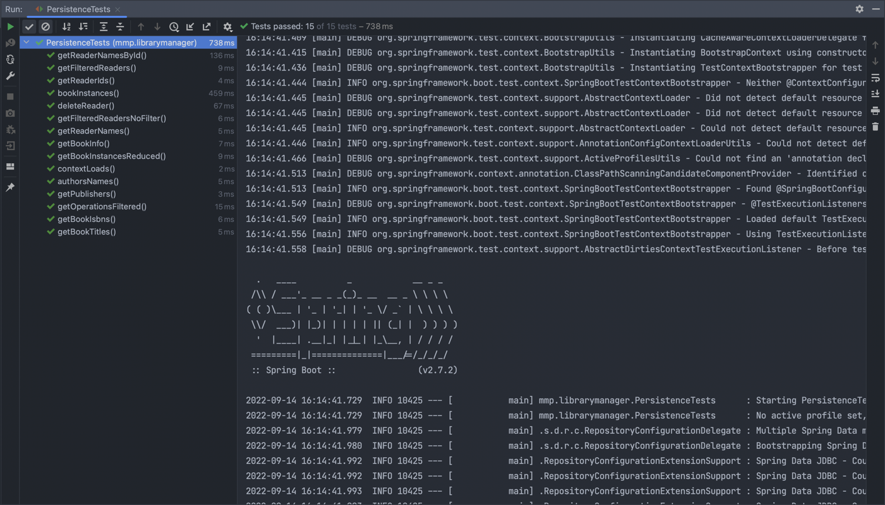
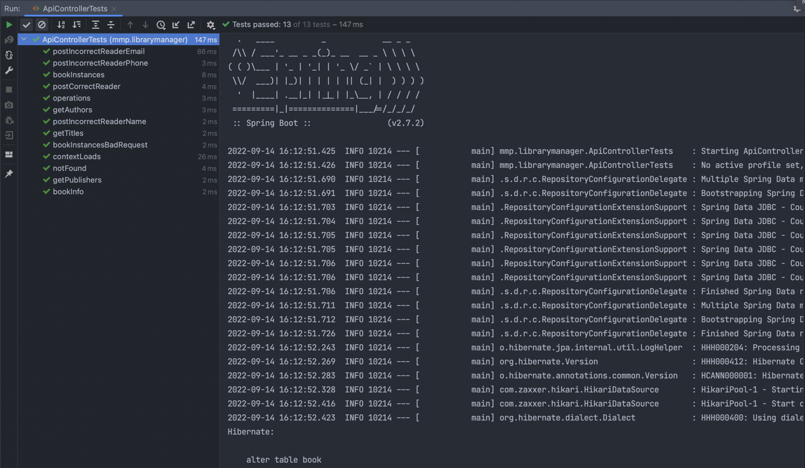

# Тестирование приложения

Для тестирования веб-приложения было написано два вида тестов — тесты API и тесты базы данных. Тесты были написаны с использованием фреймворка JUnit и находятся в директории `src/test/java/mmp.librarymanager/`.

## Тестирование базы данных
База данных тестировалась с загруженными в нее тестовыми данными из файла `data.sql`. Тесты базы данных находятся в файле [`src/test/java/mmp.librarymanager/PersistenceTests.java`](https://github.com/mishapankin/LibraryManager/blob/master/src/test/java/mmp/librarymanager/PersistenceTests.java)

Было написано 15 тестов, покрывающие все репозитории базы данных и все операции, используемые в приложении.
Все тесты пройдены успешно.

## Тестирование API
Отдельно были написаны тесты для эндпоинтов API с изпользованием MockMVC. Тесты API находятся в файле [`src/test/java/mmp.librarymanager/ApiControllerTests.java`](https://github.com/mishapankin/LibraryManager/blob/master/src/test/java/mmp/librarymanager/ApiControllerTests.java)

Было написано 13 тестов, покрывающие основные возможные ошибки в API.
Все тесты пройдены успешно.