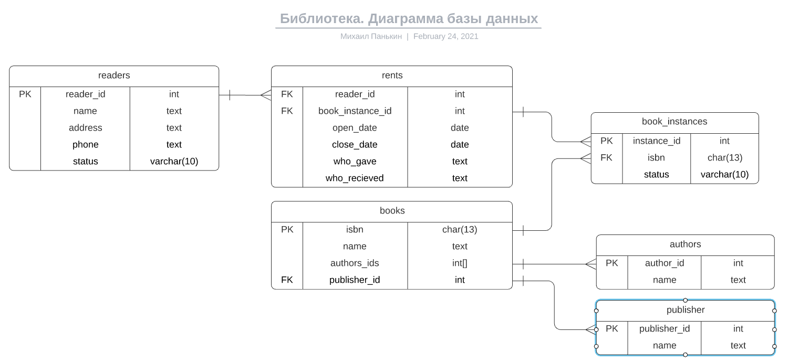

# Описание структуры базы данных

* `readers` Читатели библиотеки.
* `books` Виды книг.
* `book_instances` Конкретные экземпляры книг, которые хранятся в библиотеке.
  или находятся во врмененом пользовании читателей.
* `authors` Информация об авторах книг.
* `publisher` Информация об издательствах.
* `rents` Информация об отданных книгах.