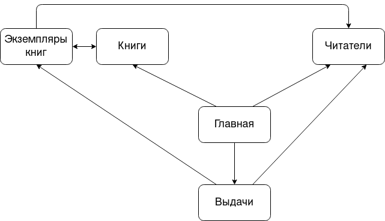

# Страницы

Переходы по гиперссылкам между страницами:

## Главная страница
* ссылки на все остальные страницы

## Каталог книг
* ссылка на главную
* таблица, содержащая информацию о книгах
* кнопки для добавления, удаления и редактирования книг
При нажатии на книгу в таблице, происходит переход на страницу с экземплярами этой книги.

## Cписок читателей
* ссылка на главную
* таблица, содержащую следующие поля: номер читательского билета, ФИО читателя, номер телефона, его статус
* строка поиска читателя по ФИО и статусу
* кнопки добавления нового, редактирования, удаления читателя
Статус читателя в таблице - выпадющее меню, при нажатии на которое можно выбрать новый статус.
  
## Страница с информацией о выдаче книг
* ссылка на главную
* таблица, содержащая информацию о выдаче книг
* строка поиска по читателю или названию книги

## Страница с экземплярами конкретной книги
* ссылка на главную
* ссылка на каталог книг
* Полная информация о книге
* таблица, содержащая информацию о каждом экземпляре книги
* кнопки для добавления, удаления, редактирования экземпляров книг.